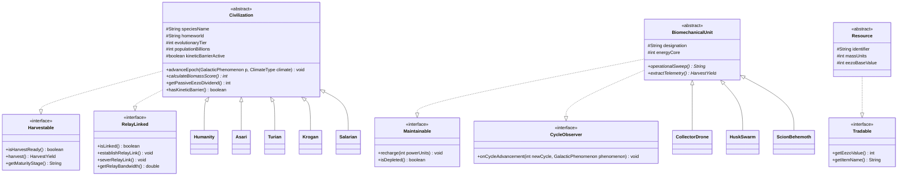

# The Harvest Effect

A turn-based cosmic farming mini-game written in Java for the Object-Oriented Programming course.

---

## Project Overview

*The Harvest Effect* adapts the mechanics of a traditional farming game into a science fiction theme inspired by the *Mass Effect* universe.

Instead of tending crops on a traditional farm, the player manages star systems across the galaxy as the Reapers:
- **Farmland plots** are represented by **Star Systems** with different climate types (Garden, Arid, Methane, Volcanic, Barren).
- **Crops** are represented by **15 organic civilizations** (Humanity, Asari, Turian, Krogan, etc.), each with different growth rates, climate affinities, and harvest yields.
- **Irrigation & network links** are handled through **Mass Relays**.
- **Field machinery & maintenance** are represented by autonomous **Biomechanical Units** (Collector Drones, Husk Swarms, Scions) that observe epoch cycles and support planetary cultivation.
- **Silo storage & commodities** are managed via a generic **Cargo Hold** storing harvested Biomass and Element Zero (Eezo).

The game can be played in two modes:
1. **Java Swing GUI**: Graphical radar star chart, interactive dialogs, and audio synthesis.
2. **Terminal CLI / Text Mode**: Complete console interface with ASCII radar maps, suitable for headless environments.

---

## Object-Oriented Design & Course Requirements

The project uses core OOP concepts seen in class, specifically focusing on abstract classes, interfaces, generic typing, and package organization.

### 1. Interfaces (`com.seb.harvesteffect.model.contract`)
- `Harvestable`: Enforces harvest contracts (`isHarvestReady()`, `harvest()`, `getMaturityStage()`).
- `RelayLinked`: Manages mass relay network links and irrigation bandwidth.
- `Maintainable`: Defines maintenance/recharging behaviors for autonomous machinery units (`recharge()`, `isDepleted()`).
- `CycleObserver`: Implements the **Observer Pattern**, receiving notifications when an epoch advances.
- `Tradable`: Implemented by trade commodities stored in the ship's hold.

### 2. Abstract Classes & Inheritance
- `Civilization` (abstract base): Contains shared logic for population growth, kinetic barrier defense, and epoch advancement. Extended by 15 concrete species (`Humanity`, `Asari`, `Turian`, `Krogan`, `Salarian`, `Batarian`, `Quarian`, `Volus`, `Hanar`, `Drell`, `Elcor`, `Vorcha`, `Rachni`, `Prothean`, `Yahg`).
- `BiomechanicalUnit` (abstract base): Defines autonomous units deployed to conditioned star systems. Extended by `CollectorDrone`, `HuskSwarm`, and `ScionBehemoth`.
- `Resource` (abstract base): Base class for physical commodities (`Biomass`, `ElementZero`).

### 3. Generics & Collections
- `CargoHold<T extends Tradable>`: Type-safe inventory with capacity constraints.
- Extensive use of typed collections (`Map<ClimateType, Double>`, `List<Civilization>`, `EnumSet`).

### 4. Custom Exceptions (`com.seb.harvesteffect.exception`)
- Root `ReaperException` class with domain-specific checked subclasses:
  - `CargoHoldFullException`
  - `CivilizationBarrierException`
  - `CivilizationPrematureException`
  - `InsufficientEezoException`
  - `InsufficientBiomassException`
  - `SystemOccupiedException`

### 5. Package Structure
```text
com.seb.harvesteffect
├── audio         (Procedural audio synthesis)
├── engine        (Game state, campaign manager, missions, save/load persistence)
├── exception     (Custom checked exceptions)
├── model
│   ├── civilization (15 concrete civilization classes)
│   ├── contract     (Core interfaces)
│   ├── entity       (Star systems, sectors, abstract base classes)
│   ├── item         (Cargo hold, resources, probes)
│   └── unit         (Autonomous units)
├── story         (Narrative dilemmas)
├── test          (Automated test suite)
└── ui            (Swing GUI panels and Terminal CLI renderer)
```

---

## UML Class Diagram



---

## How to Compile and Run

The project has no external dependencies and uses standard Java (JDK 8 or newer).

### Command-Line (javac)

**Windows (Command Prompt):**
```cmd
:: 1. Compile source files into bin/
if not exist bin mkdir bin
dir /s /b src\*.java > sources.txt
javac -encoding UTF-8 -d bin @sources.txt
del sources.txt

:: 2. Launch GUI mode (Java Swing)
java -cp bin com.seb.harvesteffect.Main --gui

:: OR launch Terminal CLI mode
java -cp bin com.seb.harvesteffect.Main

:: 3. Run automated tests
java -cp bin com.seb.harvesteffect.test.HarvestEffectTestSuite
```

**Linux / macOS:**
```bash
# 1. Compile source files into bin/
mkdir -p bin
javac -encoding UTF-8 -d bin $(find src -name "*.java")

# 2. Launch GUI mode (Java Swing)
java -cp bin com.seb.harvesteffect.Main --gui

# OR launch Terminal CLI mode
java -cp bin com.seb.harvesteffect.Main

# 3. Run automated tests
java -cp bin com.seb.harvesteffect.test.HarvestEffectTestSuite
```

*(Note: If compiling with JDK 9+ while targeting a Java 8 runtime, add the `--release 8` flag to javac).*

### Helper Scripts

Scripts are also provided in the root directory:
- **Build**: `./build.sh` (Linux/Mac) or `build.bat` (Windows)
- **Run GUI**: `./gui.sh` or `gui.bat`
- **Run CLI**: `./run.sh` or `run.bat`
- **Run Tests**: `./test.sh` or `test.bat`
- **Clean**: `./clean.sh` or `clean.bat` (removes all compiled `.class` files)

---

## Author

- **Student:** Sebastian
- **GitHub:** [sebiny12p](https://github.com/sebiny12p)
- **Course:** Object-Oriented Programming in Java (Y2S1)
