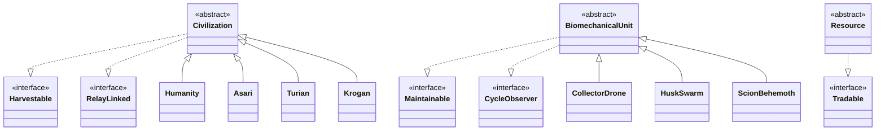

# The Harvest Effect

A turn-based cosmic farming mini-game in Java. Command the Reapers, cultivate organic civilizations across the galaxy, and harvest their evolution for Biomass and Element Zero (Eezo).

The project offers both a Java Swing GUI and a complete terminal mode, so it can be played with or without a graphical desktop.

> **Unofficial fan project.** Inspired by the Mass Effect universe; not affiliated with or endorsed by BioWare or Electronic Arts.

## Highlights

- Playable in **Java Swing** or a headless **terminal CLI**.
- Manage 24 star systems across four sectors, each with a climate and relay-network status.
- Seed and evolve 15 civilizations with distinct growth rates, climate affinities, and harvest yields.
- Research upgrades, deploy biomechanical units, terraform barren worlds, manage cargo, and save campaign progress.
- Includes a self-contained automated integration suite with 613 checks.
- Uses no external libraries; only a Java Development Kit is required.

## Quick Start

### Requirements

- JDK 8 or newer
- No external dependencies

### Windows

From Command Prompt in the project folder:

```cmd
build.bat
gui.bat
```

Use `run.bat` to launch terminal mode, or `test.bat` to compile (when needed) and run the automated test suite.

PowerShell wrappers are also available:

```powershell
.\build.ps1
.\run.ps1
.\test.ps1
```

### Linux / macOS

```bash
chmod +x build.sh run.sh gui.sh test.sh
./build.sh
./gui.sh
```

Use `./run.sh` for terminal mode and `./test.sh` for the test suite.

### Manual Compilation

If you prefer to build directly with `javac`:

```bash
mkdir -p bin
javac -encoding UTF-8 -d bin $(find src -name "*.java")
java -cp bin com.seb.harvesteffect.Main --gui
```

For terminal mode, omit `--gui`. On Windows Command Prompt, replace the compilation command with:

```cmd
if not exist bin mkdir bin
dir /s /b src\*.java > sources.txt
javac -encoding UTF-8 -d bin @sources.txt
del sources.txt
```

## How to Play

1. Start a **New Campaign** from the main menu and optionally name your flagship.
2. Follow the active mission briefing. The opening tutorial guides you through selecting Sol, deploying a Mass Relay, and seeding Humanity.
3. Advance epochs to evolve civilizations, unlock campaign progress, and react to galactic events.
4. Harvest mature civilizations to earn Biomass and Eezo; use those resources to deploy units, research upgrades, expand the relay network, or terraform worlds.
5. Save progress from the tactical console. Returning to the main menu also creates an auto-save.

The terminal version presents its available actions in-game. The GUI exposes the same core gameplay through its galactic map, panels, and dialogs.

## Project Structure

```text
com.seb.harvesteffect
├── audio         Procedural audio synthesis
├── engine        Game state, campaign flow, missions, research, and saves
├── exception     Domain-specific checked exceptions
├── model
│   ├── civilization  Concrete civilization types
│   ├── contract      Core interfaces
│   ├── entity        World and unit base types
│   ├── item          Resources, cargo, and probes
│   └── unit          Autonomous biomechanical units
├── story         Narrative dilemmas
├── test          Automated integration suite
└── ui            Swing UI and terminal renderer
```

## Object-Oriented Design

This project was built for an Object-Oriented Programming course and uses the following Java concepts as gameplay-facing parts of the design:

- **Interfaces:** `Harvestable`, `RelayLinked`, `Maintainable`, `CycleObserver`, and `Tradable` describe shared capabilities. `CycleObserver`, for example, supports epoch-advance notifications.
- **Abstract classes and inheritance:** `Civilization`, `BiomechanicalUnit`, and `Resource` provide common behaviour for concrete species, units, and cargo resources.
- **Generics and collections:** `CargoHold<T extends Resource>` provides type-safe, capacity-limited cargo storage. The game also uses typed lists, maps, and enum sets.
- **Custom checked exceptions:** `ReaperException` is the root of domain errors such as insufficient resources, premature harvests, occupied systems, and full cargo holds.
- **Packages:** gameplay, UI, persistence, narrative, and model code are separated into focused packages.

### Core Type Relationships



## Testing

Run the complete integration suite with:

```bash
java -cp bin com.seb.harvesteffect.test.HarvestEffectTestSuite
```

The suite covers core game rules, persistence, campaign progression, command-line flow, and UI rendering safety.

## Submission and Build Output

Compiled files are written to `bin/`, which is ignored by Git along with `.class` files and generated save data. The repository therefore contains source code, scripts, documentation, and tests—not compiled binaries.

## Author

- Sebastian Paris
- GitHub: [sebiny12p](https://github.com/sebiny12p)
- Originally developed for an Object-Oriented Programming course
